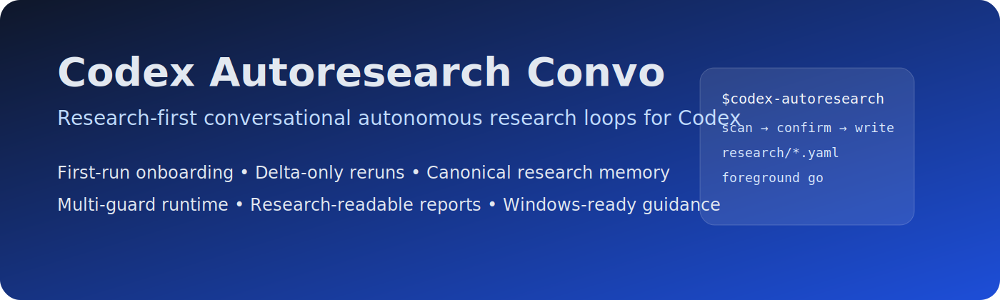

<p align="center">
  
</p>

# Codex Autoresearch Convo

Research-first, conversational autonomous research loops for Codex.

[Install](docs/INSTALL.md) · [Guide](docs/GUIDE.md) · [Examples](docs/EXAMPLES.md) · [Release](https://github.com/zonigold-zz/codex-autoresearch-ver-convo/releases) · [Notice](NOTICE) · [License](LICENSE)

## In one sentence

Convo keeps the stock `codex-autoresearch` loop core—

**modify → verify → keep/discard → log → repeat**

—but adds a research-facing control layer so Codex can onboard a repo once, remember stable assumptions, and ask only for deltas later.

## Why Convo is different

### Stock `codex-autoresearch`
- strong autonomous loop core
- good for generic engineering iteration
- more setup details often stay in the operator’s head

### Convo
- scans a research repo and proposes repo-grounded defaults
- writes repo-local research memory under `research/*.yaml`
- reuses that memory on later runs
- treats repeated guards as structured runtime items
- produces a researcher-readable summary in `reports/latest_run.md`

## Best fit

Use Convo when you want Codex to remember repo-level research assumptions such as:

- task family
- split policy
- primary metric and direction
- verify command
- guard commands
- raw-data mutability constraints
- expected report artifacts

This is especially useful for ML, neurotech, evaluation, benchmarking, ablation, and manuscript-adjacent repositories.

## 60-second start

1. Install this repository as the active repo-local skill for your target repo. See [docs/INSTALL.md](docs/INSTALL.md).
2. Open Codex in the target repo.
3. Invoke:

```text
$codex-autoresearch
Improve subject-heldout EEG classification quality without violating dataset integrity constraints.
```

4. On a first run, Convo:
   - scans the repo
   - proposes repo-grounded defaults
   - asks a short onboarding round
   - writes `research/*.yaml`
5. Launch with:
   - `foreground go`
   - or `background go`

Everything before `go` is setup.  
Everything after `go` is autonomous execution.

## First-run onboarding

If canonical research memory is missing, Convo confirms the minimum durable facts:

- research goal
- task family
- primary metric and direction
- dataset path and split policy
- guardrails and mutation constraints
- desired report artifacts

## Returning runs: delta-only

If canonical research memory already exists, Convo reads it before asking anything.

Returning-run behavior:

- reuse stable defaults from memory
- ask only for deltas
- do not re-ask the original onboarding questions unless the repo or objective changed materially

Typical delta-only questions include:

- “Keep the same split policy?”
- “Keep the same verify command?”
- “Add or remove guards?”
- “Continue the same objective, or switch metrics?”

## Canonical research memory

Convo uses three durable repo-local memory files:

- `research/project.yaml`
  - research goal, task family, objective, verify intent, guards, artifacts, notes
- `research/datasets.yaml`
  - dataset description, split assumptions, label source, mutability, known files
- `research/permissions.yaml`
  - write boundaries, guardrails, launch policy

Older repos may still contain flatter legacy YAML layouts. Convo can read those, and this repository includes a migration helper to convert them into the canonical richer schema.

## Run artifacts

### Research memory
- `research/project.yaml`
- `research/datasets.yaml`
- `research/permissions.yaml`

### Run state
- `research-results.tsv`
- `autoresearch-state.json`
- `autoresearch-lessons.md`
- `autoresearch-launch.json` (background only)
- `autoresearch-runtime.json` (background only)
- `autoresearch-runtime.log` (background only)

For research-facing repos, use:

```text
python scripts/research_report.py --repo PATH_TO_TARGET_REPO
```

to synthesize `reports/latest_run.md` from artifact truth.

## Reporting

The report helper is designed to summarize:

1. Objective
2. Metric and verification
3. Dataset and split assumptions
4. Guards and safety constraints
5. Best retained result
6. Key changes tried
7. Open blockers
8. Recommended next actions

## Repeated `--guard` usage

When launching helper-driven runs, prefer repeated `--guard` flags instead of composing one shell-specific command string.

```powershell
python .\.agents\skills\codex-autoresearch\scripts\autoresearch_runtime_ctl.py launch `
  --repo PATH_TO_TARGET_REPO `
  --goal "Improve subject-heldout EEG classification quality without violating dataset integrity constraints." `
  --metric AUROC `
  --direction higher `
  --verify "python eval_eeg.py --config configs/experiment.yaml --metric-only" `
  --guard "python guard_dataset.py" `
  --guard "python train_eeg.py --config configs/experiment.yaml"
```

This keeps guard metadata structured in state, results logs, and downstream reports.

## Foreground and background

Convo uses one explicit launch boundary:

- **Before `go`**: interactive clarification, onboarding, confirmation
- **After `go`**: no more user questions during the active run

Use `foreground` when you want to supervise or smoke-test the loop.  
Use `background` when you want a detached run and the target repo is configured for unattended operation.

## Windows notes

On Windows, pay attention to:

- repo-local symlink or junction installs for `.agents/skills/codex-autoresearch`
- trusted project behavior for project-scoped `.codex/config.toml`
- UTF-8 without BOM and LF line endings for Markdown, YAML, TOML, rules, and helper scripts

## Smoke-run snapshots

This repository includes smoke-run snapshots under `notes/smoke-runs/`.

They exist to show the full Convo pattern:

- repo scan
- first-run memory creation
- delta-only return behavior
- explicit verify and repeated guards
- artifact-backed reporting

## License and notice

This repository is distributed under the MIT License. See [LICENSE](LICENSE).

This repository is also a derivative work based on `leo-lilinxiao/codex-autoresearch`. See [NOTICE](NOTICE) for attribution and derivative-work context.
